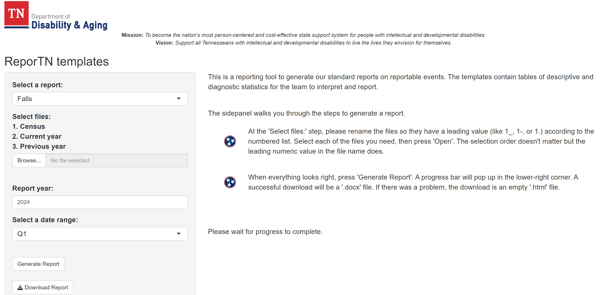

# ReporTN


**Author:** Charles C Barnes

**Institution:** State of Tennessee - Department of Disability and Aging
(DDA)

**Role:** Volunteer Data Specialist

# Summary

The East Region Therapeutic Services team uses flat files to generate
reports to better serve people in the state supported by DDA to live
happy and full lives. A major aspect of reporting considers adverse
events to identify where and for whom supportive services can be
improved. This repo contains R Quarto markdown documents to generate
static, internal reports on adverse events including falls, skin
breakdown, choking, aspiration, and pneumonia. To generate reports, you
will need access to flat files with the format used by the team and also
see <a href="#sec-function" class="quarto-xref">Section 3</a>.

# Motivation

The DDA therapeutic services team in the east region keeps event records
for people supported by the state so that they can ultimately tailor
therapeutic services to meet individual needs. This is achieved through
agency training and advocacy on behalf of supported people. However,
retrieving actionable information from event data is time prohibitive
with reporting methods in Excel and due to their various consultative
roles.

When considering alternative software for the team, `R` is a verified
coding language available for state employees to use. These report
templates use the `R` coding language to import Excel files and create
tables that would typically be done completely within Excel.

# Function

The repo supports two ways to generate reports: 1) by R Shiny app UI and
2) at the command line interface:

## 1) R Shiny App with R Markdown

The app (`ReporTN/app.R`) uses `.rmd` files to make reports. The app
user interface walks through the steps to make a report.



## 2) CLI with Quarto

The command line interface uses `.qmd` files to make reports. Update
parameters in `.yml` files (in the `params` folder) for source data and
time span of the report. Reports and their corresponding `.yml` files
match by leading numbers (like `1_`).

Here is an example of an updated `.yml` file:

``` default
1 ---
2 census_path: "E:/2023 Agency Census Listing.xlsx"
3 current_falls_path: "E:/2023 - FALLS Event Tracking.xlsx"
4 previous_falls_path: "E:/2022 - FALLS Event Tracking.xlsm"
5 year: "2023"
6 months: "NA"
```

Line 6  
Use `months: "NA"` to make an annual report and `["01", "02", "03"]` (MM
syntax for month) to make a Q1 report.

Execute a prompt like this one from the command line to make the report:

``` default
quarto render 1_falls.qmd --execute-params params/1_fall.yml
```

# Requirements

Check these criteria before using report templates.

1.  Flat files with source data (`.xlsx`/`.xlsm`) should have the same
    column arrangements and data types as indicated in
    `.titles/event_titles.xlsx`. If necessary, rearrange the source data
    rather than modifying the `event_titles.xlsx` file.

2.  Have R and [R
    Studio](https://rstudio-education.github.io/hopr/starting.html "Installing R and RStudio")
    (or stand-alone
    [Quarto](https://quarto.org/docs/get-started/ "Get Started") with
    your preferred IDE) installed.

# Contact

If you have questions about the repo, contact me (Charles) at
barnes225@gmail.com
